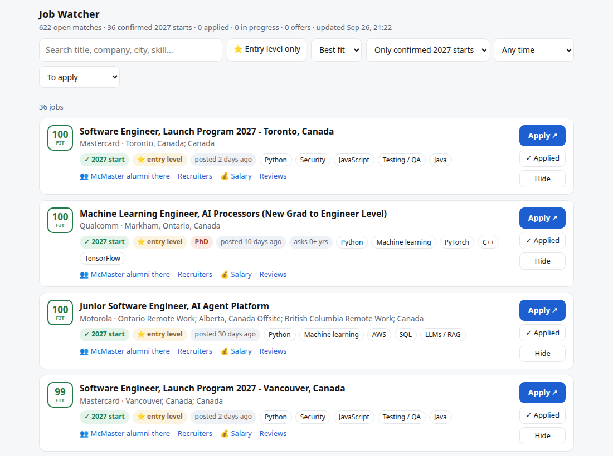
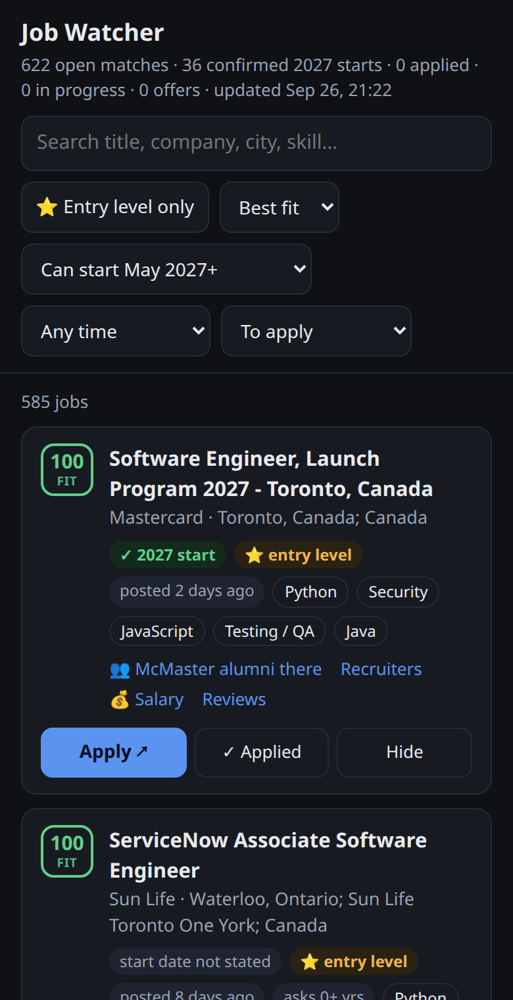

# 💼 Job Posting Watcher

Pushes a phone alert within ~15 minutes of an **entry-level tech job in Canada** being posted,
by reading **~930 employers' hiring systems directly** (the same data their careers pages show),
so alerts often land before the job reaches LinkedIn or Indeed. A private web app ranks every
open job against my resume and tracks each application from "applied" to "offer".

**Status:** ✅ live on AWS Lambda, scanning every 15 minutes at **~$0/month**. All numbers below
were measured on the deployed system.

<p>
  
  
</p>

---

## 🎯 Why
New-grad roles are often reviewed as applications arrive, so the first days after a posting
matter. Checking dozens of careers pages by hand every day doesn't scale, and job boards
lag behind the employers' own systems. This watches the source instead.

## ⚙️ How it works
```
EventBridge Scheduler (every 15 min) -> Lambda: scan
    ├─ 21 source adapters, 16 threads  -> ~64,000 postings from ~930 employers in < 1 min
    ├─ new job IDs only (SQLite remembers every ID ever seen)
    ├─ filters: tech title · not senior · not intern/co-op · in Canada · ≤ 2 yrs · start date
    ├─ fit score vs. resume, cross-feed de-duplication, closed-posting detection
    └─ ntfy push alert  (⭐ = explicit new grad / 2027 start)
EventBridge Scheduler (8:05 / 21:05 Toronto) -> Lambda: digest + follow-up reminders
Vercel rewrite -> Lambda function URL         -> web app: rank, apply, track (password sign-in)
S3                                            -> jobs.db (SQLite) + status.json (applications)
```

## 🔌 Sources: 21 adapters, ~930 employers

| Hiring system | Employers | Examples |
|---|---:|---|
| Workday | 264 | RBC, TD, CIBC, BMO, Manulife, Sun Life, CAE, NVIDIA, Salesforce, Accenture |
| Greenhouse | 186 | Stripe, Databricks, Cloudflare, Geotab, Faire, Instacart |
| Ashby | 144 | Wealthsimple, Cohere, 1Password, Neo Financial, Jobber, OpenAI |
| SmartRecruiters | 92 | Ubisoft, ServiceNow, Intelerad |
| Oracle Recruiting Cloud | 78 | JPMorgan, Nokia, Fortinet, Honeywell, Ford, Texas Instruments |
| Lever | 73 | PointClickCare, Waabi, Wattpad, Palantir |
| Rippling · Workable · BambooHR · Recruitee | 78 | Genetec, Valsoft, VersaFile, D-Wave |
| SAP SuccessFactors (RSS + search) | 6 | Scotiabank, Rogers, TELUS, Bell, Deloitte Canada, EY Canada |
| Custom sites | 8 | Google, Microsoft & Qualcomm (Eightfold), IBM, Amazon, AMD (Jibe), Atlassian, Shopify |
| Job boards | 2 | Canada's Job Bank, the SimplifyJobs new-grad list |

**How the list was built:** ~4,200 hiring-system links were mined from public new-grad lists,
each was probed live, and the **741 employers with Canadian postings** were added automatically.
Another 78 came from probing 184 Oracle Recruiting Cloud sites. Staffing agencies are included
but disabled because they flood alerts with reposts.

## 🧹 Filtering
1. **Tech title** (English and French): software, data, ML/AI, cloud, DevOps, security, QA, IT…
2. **Not senior** (senior, staff, lead, manager, III+, "Premier conseiller"…) and **not student**
   (intern, co-op, stagiaire, "Summer Analyst", 8-month terms…).
3. **In Canada:** structured country fields when a source has them, otherwise location parsing
   that won't confuse Burlington, ON with Burlington, MA.
4. **Experience:** the smallest "N years of experience" in the description must be ≤ 2.
5. **Start date** (I graduate April 2027):
   - ✓ **2027 start:** a 2027 title, a new-grad program, "class of 2027", a start from May 2027. Ranked first, always alerts.
   - ✗ **Wants a start before May 2027:** ASAP, immediate start, fixed-term contracts, January starts. Hidden, never alerts.
   - **Not stated:** shown on the page and in digests; phone alerts begin February 2027.

## 👥 Profiles
One scan, several people. `profiles.py` lists who the watcher hunts for: me (entry-level tech, can't
start before May 2027) and a friend (entry-level business roles: finance, accounting, marketing, sales,
consulting, HR, supply chain, analyst). Each company is listed once per scan and every profile filters
the same postings its own way, so a second person costs almost nothing extra. Each profile has its own
password (the password decides whose page opens), phone alerts, digests and Applied/Hide marks. Business
titles are about 10x more common than tech ones, so the business profile only buzzes for explicitly
entry-level jobs; the rest are on the page and in the digest. A new profile's page is filled once from
the last 45 days of postings.

## ⭐ Fit score
`fit.py` scores each job 0–100 against the skills on my resume (Python, AWS, Terraform, React,
security, PyTorch/RAG, testing…) plus title family, experience asked, and commute distance from
Hamilton. It's plain keyword scoring, so it's free and explainable: every card shows which skills
matched, and flags like *French required*, *Clearance* or *PhD*.

## 🖥️ Web app
- **Apply ↗** opens the posting, then asks whether you applied.
- **My applications:** stages (applied → online assessment → interview → offer / rejected / no response),
  notes, and a follow-up nudge in the morning digest after 14 days without an update.
- **Referral shortcuts:** McMaster alumni and recruiters at the company on LinkedIn, salary and reviews.
- Search, "Best fit" / "Newest" sort, start-date and posted-within filters, NEW badges since your last visit.
- Works on a phone, follows light/dark mode. Lives at a short Vercel address that passes requests through to the Lambda; asks for a password once per device.

## ☁️ AWS and cost
Provisioned with Terraform (`infra/main.tf`): one Python 3.12 Lambda (1 GB), EventBridge Scheduler
(15-minute scans and digests in Toronto time), an S3 bucket, a function URL, and least-privilege
IAM scoped to two S3 objects and one log group. Measured: a scan takes ~56 s and peaks at ~680 MB.

| Piece | Monthly use | Free allowance | Cost |
|---|---|---|---|
| Lambda | ~160,000 GB-s | 400,000 GB-s, always free | $0 |
| EventBridge Scheduler | ~3,000 runs | 14 million, always free | $0 |
| S3 writes | ~900 PUTs | not free | ~$0.005 (rounds to $0) |
| CloudWatch Logs (14-day retention) | a few MB | 5 GB, always free | $0 |

S3 writes are the only paid item, so the database is saved hourly or right after an alert instead
of every scan (every scan would be ~$0.03/month).

## 🚀 Setup
Python 3.10+ standard library only; no `pip install` needed.
```bash
cp config.env.example config.env        # set JOBS_NTFY_TOPIC, then subscribe to it in the ntfy app
python3 watcher.py scan --dry-run      # what it would alert on, touches nothing
python3 watcher.py scan                # first run per company saves silently; later runs alert
python3 watcher.py serve               # web app on http://localhost:8765
python3 watcher.py recent 7            # open matches from the last 7 days, in the terminal
python3 watcher.py test-notify         # check your phone gets alerts
```
**Deploy to AWS** (Terraform + AWS CLI configured):
```bash
printf 'ntfy_topic = "your-topic"\n' > infra/terraform.tfvars
./deploy.sh      # first time: creates everything, uploads state, sends the web app link to your phone
./update.sh      # afterwards: ships code changes (never touches the database in S3)
```

**Add a company:** find which hiring system its careers page uses (job links give it away:
`myworkdayjobs.com`, `greenhouse.io`, `jobs.lever.co`, `ashbyhq.com`…) and add a line to
`companies.json`. Workday ids are `tenant/wdN/site` from `https://tenant.wdN.myworkdayjobs.com/site`.

## 🐛 Real bugs found by validating against live data
- **Pinned postings hid every new TD job.** TD pins ~50 old postings above its date-sorted
  Workday list, so "stop paging at an all-seen page" never reached new jobs. Fixed by paging
  until the date-sorted section starts.
- **A SQLite lock leak froze scans for an hour.** A thread that failed mid-transaction kept the
  write lock. Fixed with one short, always-closed transaction per company, serialized writes,
  WAL mode, and a lock so only one scan runs at a time.
- **The first scan hid still-open jobs** (e.g. a Stripe new-grad role posted 26 days earlier);
  the first-scan window is now 45 days.
- **Loose words matched the wrong jobs:** "Flight *Information* Region" (air traffic control)
  matched a pattern meant for *informatique*; French *sécurité* also means workplace safety;
  "Assurance auto*mobile*" matched *mobile*; Burlington, MA and Hamilton, NJ counted as Canada.
  Every fix was checked against each job it reclassified. One pass dropped 101 jobs and 3 real
  roles were restored.
- Microsoft's API rate-limits bursts, so requests back off and retry, and Microsoft/Qualcomm are polled hourly.

## ⚠️ Known limits
- Not covered: Apple (private API), Meta and Tesla (bot protection), Uber, SAP, Kinaxis, OpenText, CGI.
- SuccessFactors RSS returns only the 20 newest postings, fine at a 15-minute cadence.
- Fit scoring and start-date detection are keyword/regex-based: they can't tell a required
  skill from a nice-to-have.
- Closed postings are detected on feeds that return a whole board, plus a daily check for Workday;
  elsewhere a job drops off after 45 days.

## 🗂️ Layout
| File | What's in it |
|---|---|
| `sources.py` | the 21 adapters, one per hiring system or site |
| `filters.py` | tech / business / seniority / student / Canada / experience / start-date rules |
| `profiles.py` | who the watcher hunts for, and each person's settings |
| `fit.py` | resume-fit scoring |
| `watcher.py` | scan, alerts, digests, follow-ups, CLI |
| `webui.py` | the web app (single page, no build step) |
| `lambda_function.py` | Lambda entry point: S3 sync, schedules, function URL |
| `infra/main.tf`, `deploy.sh`, `update.sh` | AWS infrastructure, one-command deploy, and updates |
| `companies.json` | the employer list |
